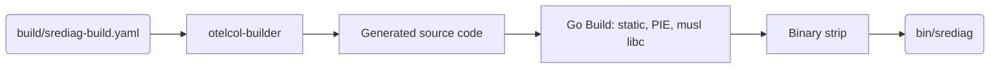
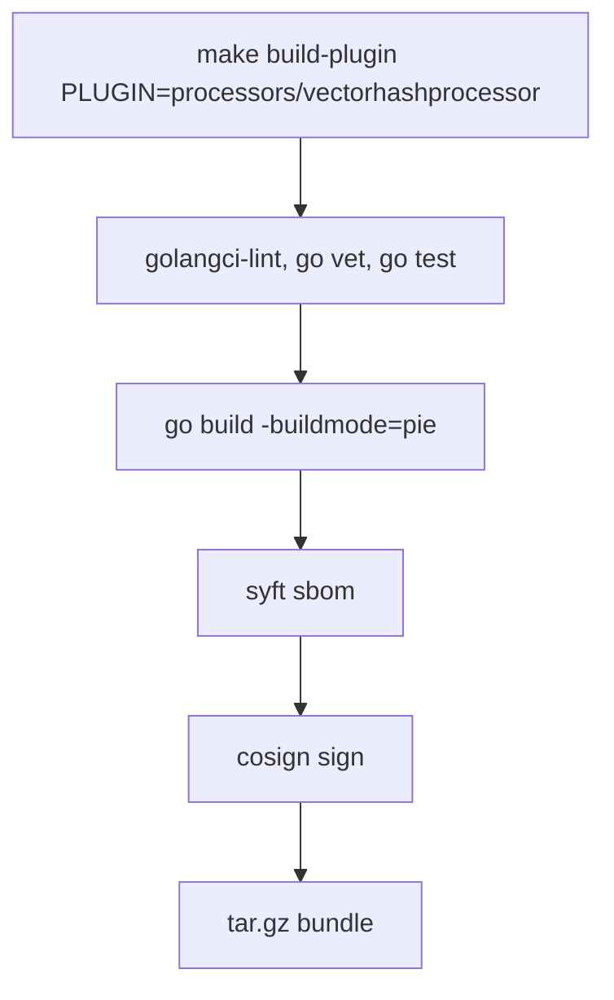
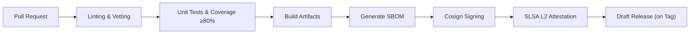

# SREDIAG Build & Release Architecture

This document specifies the detailed architecture and implementation strategies used in SREDIAG's build and release processes. It clarifies the workflows, artifact management, version synchronization, CI/CD integration, and multi-platform container distribution, ensuring reproducibility, security, and ease of maintenance.

---

## 1 · Artifact Matrix Overview

The following artifacts are generated, verified, and signed in the build pipeline:

| Artifact            | Format                             | Description                                              | Build Step               |
|---------------------|------------------------------------|----------------------------------------------------------|--------------------------|
| **Collector Binary**| Static PIE ELF binary              | Unified collector binary                                 | `mage build:collector`   |
| **Plugin Bundles**  | `.tar.gz` (binary + manifest + sig)| Dynamically loadable plugins                             | `mage build:plugin`      |
| **OCI Container**   | Distroless multi-arch container    | Container image for Kubernetes and Docker runtimes       | `mage build:image`       |
| **SBOM**            | CycloneDX 1.5 JSON                 | Software Bill of Materials                               | `mage build:sbom`        |
| **Attestation**     | SLSA Level 2 (`in-toto.jsonl`)     | Provenance metadata for audit and compliance             | GitHub Actions           |
| **Signature**       | Cosign OCI signatures              | Verification of artifact integrity                       | GitHub Actions           |

All artifacts intended for deployment (manual or automated via Helm/ArgoCD) must pass signature verification.

---

## 2 · Static Collector Build Pipeline

SREDIAG uses the OpenTelemetry Collector builder tool (`otelcol-builder`) to produce a single static binary (`bin/srediag`):



- **Module Management:** All modules explicitly version-pinned (no forks).
- **Metadata Injection:** Version, commit, and build date embedded via `go:embed`.

---

## 3 · Plugin Build & Packaging Pipeline

Plugins follow a strictly enforced, reproducible build workflow:



- **ABI Compatibility:** Embedded ABI fingerprint using Go's symbol tables (`go tool nm | sha1`).
- **Manifest:** Generated post-build, includes SHA-256 hash and cosign signature reference.

---

## 4 · Mage Build Targets Dependency Graph

Mage targets orchestrate all local and CI/CD builds, ensuring consistency:

| Target             | Dependencies                               | Output / Description                              |
|--------------------|--------------------------------------------|---------------------------------------------------|
| `build`            | `lint → test → build:collector`            | Local development collector binary                |
| `build:collector`  | —                                          | Static collector binary                           |
| `build:plugin`     | `codegen → vet → test`                     | Single plugin binary and bundle                   |
| `build:image`      | `build:collector`                          | Multi-arch OCI container                          |
| `sbom`             | `build:collector`                          | CycloneDX SBOM JSON                               |
| `sign`             | `sbom`                                     | Cosign artifact signatures                        |
| `ci`               | `lint → test → build → sbom → sign`        | Full CI/CD pipeline for GitHub Actions            |

**Environment Variables:** Respect `GOFLAGS`, `CGO_ENABLED=0`, and cross-platform `TARGETOS/TARGETARCH`.

---

## 5 · Version Synchronization Strategy

Ensures coherence between Go modules and builder YAML configurations:

```bash
srediag build update-yaml-versions \
  --yaml build/srediag-build.yaml \
  --gomod go.mod \
  --plugin-gen plugin/generated
```

Steps executed:

1. Extract module versions from `go.mod`.
2. Update corresponding YAML configurations.
3. Report discrepancies (failure unless `--write` is provided).

---

## 6 · CI/CD Integration (Provider-Agnostic)

SREDIAG’s build pipeline is CI-provider agnostic and follows industry-standard best practices:



- **Static Analysis:** Uses `golangci-lint`, `govulncheck` for security compliance.
- **SLSA Provenance:** Artifacts are attested to satisfy audit and regulatory requirements.
- **Draft Release:** Created only upon tag events for manual approval before publishing.

---

## 7 · Multi-Architecture Container Image

OCI images produced via Docker buildx:

```bash
docker buildx bake \
  --platform linux/amd64,linux/arm64 \
  -f build/docker-bake.hcl
```

- **Base Image:** `gcr.io/distroless/static:nonroot` for minimal attack surface.
- **Image Metadata:** OCI annotations (`org.opencontainers.image.*`), embedded SBOM.

---

## 8 · Recommended Developer Workflow

A standardized, reproducible local development workflow:

1. **Build the collector binary**:

    ```bash
    make build
    ```

2. **Local Service Run**:

    ```bash
    ./bin/srediag service --config configs/srediag.yaml
    ```

3. **Develop and Test a Plugin**:

    ```bash
    cd plugins/processors/myprocessor
    make all
    srediag plugin install --file bundle.tar.gz --scope cli
    srediag plugin enable processor myprocessor
    ```

4. **Advanced Debugging**:
    Utilize Delve (`dlv`) for debugging plugins seamlessly.

---

## 9 · Build Error Codes & Meaning

Consistent CLI exit codes for easy CI/CD and scripting integrations:

| Code | Meaning                                          |
|------|--------------------------------------------------|
| 0    | Success                                          |
| 1    | Generic error (unexpected failures)              |
| 2    | Version mismatch (between builder YAML and go.mod)|
| 3    | Lint or vet checks failed                        |
| 4    | Unit tests failed                                |
| 5    | Cosign or signature verification error           |

---

## 10 · Cross-Reference & Related Documents

| Component                               | Related Documentation                   |
|-----------------------------------------|-----------------------------------------|
| Collector & Pipeline Management         | [`architecture/service.md`](service.md) |
| Plugin Manifest & Execution Rules       | [`configuration/plugins.md`](../configuration/plugins.md) |
| CLI Build Commands                      | [`cli/build.md`](../cli/build.md)       |
| Security & Artifact Signing             | [`architecture/security.md`](security.md)|
| Diagnostics Command Integration         | [`architecture/diagnose.md`](diagnose.md)|
