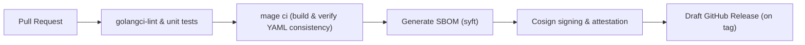

# SREDIAG — Build-time Configuration

SREDIAG compiles a fully **static binary** of the OpenTelemetry Collector, along with selected first-party or third-party plugins. The build process leverages the upstream `otelcol-builder` tool, driven by a single authoritative YAML configuration: **`build/srediag-build.yaml`**.

This document describes the build-time YAML schema, usage patterns, integration workflows, and troubleshooting procedures to ensure consistent and reproducible artifact generation.

---

## 1 · YAML Schema Overview

A typical `srediag-build.yaml` configuration:

```yaml
dist:
  name: srediag
  description: "SRE Diagnostics Collector"
  version: "0.1.0"
  output_path: ./bin/srediag

receivers:
  - gomod: go.opentelemetry.io/collector/receiver/otlpreceiver v0.124.0
  - gomod: github.com/srediag/receivers/journaldreceiver v0.1.0

processors:
  - gomod: go.opentelemetry.io/collector/processor/batchprocessor v0.124.0
  - gomod: github.com/srediag/processors/vectorhashprocessor v0.1.0

exporters:
  - gomod: go.opentelemetry.io/collector/exporter/otlpexporter v0.124.0
  - gomod: github.com/srediag/exporters/clickhouseexporter v0.1.0

extensions:
  - gomod: go.opentelemetry.io/collector/extension/healthcheckextension v0.124.0
```

### 1.1 · Schema Details

| Field              | Description                                              | Required? |
|--------------------|----------------------------------------------------------|-----------|
| `dist.name`        | Name of the output binary                                | **Yes**   |
| `dist.description` | Human-readable binary description                        | No        |
| `dist.version`     | SemVer-compatible version                                | **Yes**   |
| `dist.output_path` | Path to the generated collector binary                   | **Yes**   |
| `receivers`        | Receiver modules (`gomod` paths and exact versions)      | **Yes**   |
| `processors`       | Processor modules (`gomod` paths and exact versions)     | **Yes**   |
| `exporters`        | Exporter modules (`gomod` paths and exact versions)      | **Yes**   |
| `extensions`       | Extension modules (`gomod` paths and exact versions)     | No        |

**Important:**

- Every referenced module **must** include the exact Go module path and pinned version to guarantee reproducibility.
- Components missing here **cannot be referenced at runtime**. The service startup fails if unrecognized components appear in the pipeline YAML.

---

## 2 · Building Collector & Plugins

Build commands (`srediag build`) use the provided YAML specification:

**Build All Components:**

```bash
# Builds complete static collector and plugins
srediag build all --config build/srediag-build.yaml
```

- Output: static binary at `./bin/srediag`
- Plugins are individually packaged as bundles (`.tar.gz`) in `./plugins/`.

**Build Single Plugin Only:**

```bash
# Builds specified plugin independently
srediag build plugin --type processor --name vectorhashprocessor
```

- Output: binary & manifest bundle in `./plugins/vectorhashprocessor.tar.gz`

---

## 3 · CI/CD Integration

The YAML configuration is the cornerstone for reproducible CI/CD pipelines:

**Mage Integration (`mage ci`):**

- Runs linting, testing, and builds all artifacts to enforce YAML consistency.
- Generates a Software Bill of Materials (SBOM) using `syft`.
- Signs artifacts with `cosign`, producing verifiable signatures and SLSA provenance attestations.

**CI/CD Steps Overview:**



---

## 4 · Version Synchronization Utility

Use the built-in version synchronization helper to ensure YAML and `go.mod` coherence:

```bash
srediag build update-yaml-versions \
  --yaml build/srediag-build.yaml \
  --gomod go.mod \
  --plugin-gen plugins/generated
```

**Workflow:**

1. Extracts module versions from `go.mod`.
2. Validates module versions against YAML components.
3. Generates a diff; applies with `--write` flag if approved.

---

## 5 · Multi-Architecture Container Build

The collector binary is embedded in a multi-architecture OCI container, using Docker `buildx`:

```bash
docker buildx bake \
  --platform linux/amd64,linux/arm64 \
  -f build/docker-bake.hcl
```

- Base Image: `gcr.io/distroless/static:nonroot`
- Includes OCI annotations (`org.opencontainers.image.*`) and SBOM digest references.

---

## 6 · Local Development Workflow

A practical workflow for developing and testing locally:

```bash
# 1. Build collector
make build

# 2. Run locally
./bin/srediag service --config configs/srediag.yaml

# 3. Plugin Development Example:
cd plugins/processors/vectorhashprocessor
make all
srediag plugin install --file bundle.tar.gz --scope service
srediag plugin enable processor vectorhashprocessor
```

- For debugging, Delve (`dlv`) can be used seamlessly against compiled plugins.

---

## 7 · Error Handling & Troubleshooting

Standardized error codes for the build CLI:

| Exit Code | Reason                                          | Action                                       |
|-----------|-------------------------------------------------|----------------------------------------------|
| 0         | Success                                         | None                                         |
| 1         | General (unexpected) error                      | Inspect logs                                 |
| 2         | Version mismatch (YAML ↔ `go.mod`)              | Run `update-yaml-versions --write`           |
| 3         | Lint or vet failed                              | Correct lint errors                          |
| 4         | Unit tests failed                               | Fix tests                                    |
| 5         | Cosign signing or verification failed           | Check artifact integrity & signing keys      |

Common pitfalls and quick resolution:

| Issue                                        | Possible cause                                      | Solution                                  |
|----------------------------------------------|-----------------------------------------------------|-------------------------------------------|
| "component not found" on startup             | Component missing in YAML spec                     | Add missing component to build YAML       |
| Plugin ABI mismatch                          | Agent and plugin built with different Go versions  | Ensure consistent Go versions             |
| Collector doesn't reflect YAML changes       | Forgetting to run `build all` after YAML changes   | Always run `build all` after YAML update |

---

## 8 · Cross-Document References

| Topic                      | Document                                       |
|----------------------------|------------------------------------------------|
| Plugin Runtime & Management| [Plugin Configuration](plugins.md)             |
| Security & Signing         | [Security Configuration](security.md)          |
| Service & Collector        | [Service Configuration](service.md)            |
| Diagnostics Subsystem      | [Diagnostics Configuration](diagnose.md)       |
| Architecture Overview      | [Build Architecture](../architecture/build.md) |

---

## 9 · Document Governance

- Licensed under MIT License © 2025 Integra SH
