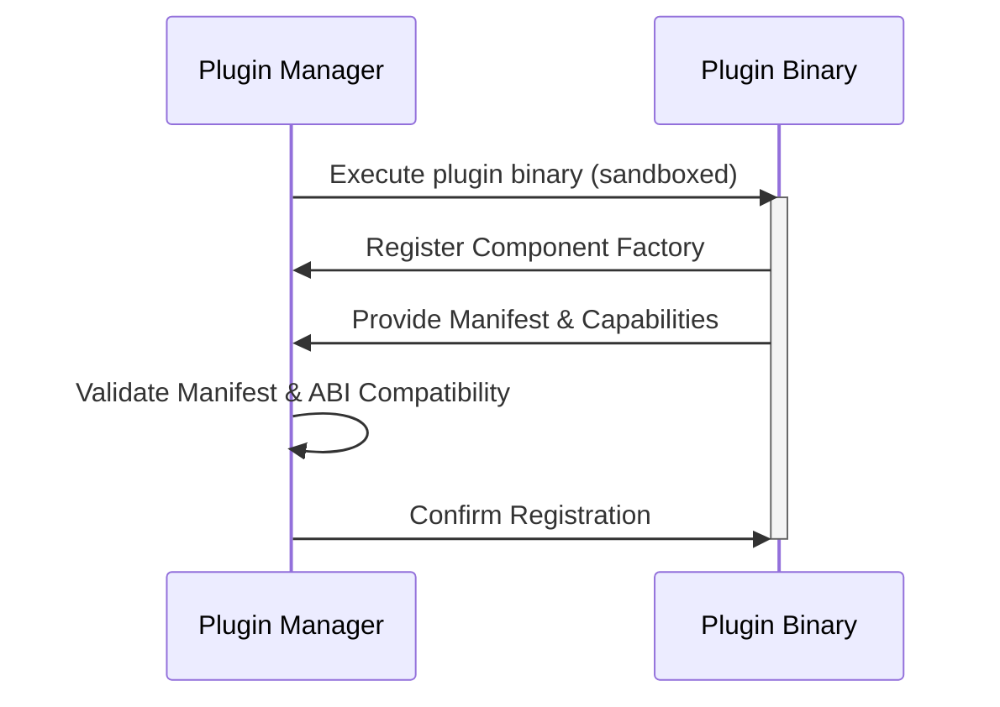
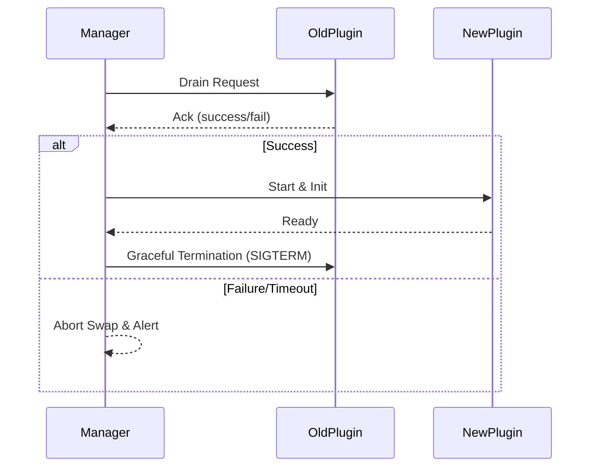

# SREDIAG — Plugin Architecture

This document describes the architecture and implementation details of SREDIAG’s **plugin system**, including dynamic plugin loading, secure runtime sandboxing, IPC mechanisms, lifecycle management, and integration into the collector pipeline and CLI diagnostics.

---

## 1 · Architectural Overview

Plugins are dynamically loadable binary extensions that augment SREDIAG’s built-in Collector capabilities. They provide specialized telemetry processing, diagnostics, and observability features without requiring the core binary to be recompiled or restarted.

### 1.1 · Plugin Architecture Layers

```ascii
┌───────────────────────────────────────────────────────────┐
│                 SREDIAG Core Runtime                      │
│                                                           │
│   ┌───────────┐     ┌───────────┐     ┌───────────┐       │
│   │ Receivers │───▶ │Processors │───▶ │ Exporters │       │
│   └───────────┘     └───────────┘     └───────────┘       │
│         ▲                 ▲                  ▲            │
│         │                 │                  │            │
│         └─────────┬───────┴───────┬──────────┘            │
│                   │               │                       │
│           ┌───────────────────────────┐                   │
│           │       Plugin Manager      │                   │
│           │ (Sandbox, IPC, lifecycle) │                   │
│           └───────────────┬───────────┘                   │
│                           │                               │
│           ┌───────────────▼─────────────┐                 │
│           │ Dynamically Loaded Plugins  │                 │
│           │  (Receiver, Processor,      │                 │
│           │   Exporter, Diagnostics)    │                 │
│           └─────────────────────────────┘                 │
│                           │                               │
│              Seccomp/AppArmor Sandboxes                   │
│                                                           │
└───────────────────────────────────────────────────────────┘
```

### 1.2 · Plugin Types Supported

| Type         | Responsibility                                               | Example                  |
|--------------|--------------------------------------------------------------|--------------------------|
| **Receiver** | Ingest telemetry from external sources                       | `journaldreceiver`       |
| **Processor**| Transform, deduplicate, compress telemetry                   | `vectorhashprocessor`    |
| **Exporter** | Forward telemetry to external destinations                   | `clickhouseexporter`     |
| **Diagnostics**| Provide runtime diagnostics and checks via CLI             | `perfprofiler`           |
| **Extension**| Special observability or integration capabilities            | `healthcheckextension`   |

---

## 2 · Plugin Lifecycle & Management

The Plugin Manager handles the full lifecycle of plugins dynamically at runtime, providing isolation, validation, and seamless integration with the Collector and CLI.

### 2.1 · Loading & Initialization Sequence



- **Manifest Validation:** SHA-256 and Cosign signatures verified at load time.
- **ABI Compatibility:** Go runtime and OTel Component API checked (must match agent binary exactly).

### 2.2 · Hot-Swap and Draining Protocol

Plugins support zero-downtime upgrades:



- **Draining timeout:** configurable (`30s` default).
- **Abort policy:** clearly defined rollback if drain fails.

---

## 3 · Plugin Runtime Environment (Sandboxing)

Plugins run under strict security sandbox policies to protect host system resources.

### 3.1 · Seccomp & AppArmor Profiles

| Policy               | Enforcement                       | Restrictions                                 |
|----------------------|-----------------------------------|----------------------------------------------|
| **Seccomp**          | Linux kernel enforced (`default`) | No ptrace, no raw sockets, restricted syscalls |
| **AppArmor**         | Linux kernel policy (`strict`)    | Read-only `/proc`, `/sys`, restricted FS access |

### 3.2 · Resource Quotas & Cgroups

| Resource         | Quota                | Enforcement                  |
|------------------|----------------------|------------------------------|
| **CPU**          | Percentage soft cap (`cpu.weight`) | Dynamic throttling            |
| **Memory**       | RSS limit per-plugin (`mem_guard`) | Enforced via Cgroups OOM kill |

---

## 4 · Inter-Process Communication (IPC)

Plugins and the core runtime communicate efficiently via IPC mechanisms.

- **IPC Transport:** Shared memory channels (`shmipc-go`) for high throughput.
- **Data Serialization:** FlatBuffers/Protobuf for zero-copy data passing.
- **Lifecycle Signaling:** Unix signals (`SIGTERM`) for graceful shutdown.

---

## 5 · Plugin Manifest Schema

Every plugin bundle includes a descriptive manifest (`manifest.yaml`):

```yaml
name: vectorhashprocessor
type: processor
version: 0.1.0
sha256: "<hash>"
cosign_signature: "<sig>"
entrypoint: "./vectorhashprocessor"
capabilities:
  - processor/vectorhash
  - diag/dedup-stats
```

- **Manifest validation:** SHA-256 hash matching and Cosign verification during loading.

---

## 6 · Plugin SDK Contract

Plugin developers follow a simple, type-safe SDK:

```go
type Plugin interface {
    Init(context.Context, PluginHost) error
    Register(factory CollectorFactory) error
    Capabilities() []string
    Shutdown(context.Context) error
}
```

- Plugins expose their components through the CollectorFactory.
- Diagnostic plugins additionally expose CLI commands.

---

## 7 · CLI & Diagnostic Integration

Diagnostic plugins register directly into the CLI subsystem:

```go
func (p *PerfProfilerPlugin) RegisterCLI(cmd *cobra.Command) {
    cmd.AddCommand(&cobra.Command{
        Use:   "cpu-profile",
        Short: "Collect CPU profiling data",
        RunE:  p.runProfile,
    })
}
```

- Dynamically loaded diagnostic plugins appear under `srediag diagnose`.

---

## 8 · Observability & Metrics

Plugin Manager and plugins expose consistent telemetry metrics:

| Metric Name                             | Type    | Description                           |
|-----------------------------------------|---------|---------------------------------------|
| `srediag_plugin_load_total{name,status}`| counter | Total load attempts (`name`, `status`)|
| `srediag_plugin_runtime_errors{name}`   | counter | Plugin execution errors               |
| `srediag_plugin_memory_bytes{name}`     | gauge   | Current memory usage per plugin      |

---

## 9 · Troubleshooting & Error Handling

Standardized error codes and troubleshooting steps:

| Error Scenario                   | Recommended Action                          |
|----------------------------------|---------------------------------------------|
| Manifest validation failed       | Check SHA256 & Cosign signatures            |
| ABI mismatch error               | Rebuild plugin & collector with same Go/OTel|
| Seccomp violations               | Adjust plugin syscall policy                |
| High plugin resource usage       | Verify cgroup limits & configuration        |

---

## 10 · Cross-Document References

| Component                       | Detailed Documentation                   |
|---------------------------------|------------------------------------------|
| Configuration & YAML Reference  | [`configuration/plugins.md`](../configuration/plugins.md) |
| Service & Pipeline Integration  | [`architecture/service.md`](service.md)  |
| Security & Hardening Practices  | [`architecture/security.md`](security.md)|
| Diagnostics Commands & CLI      | [`architecture/diagnose.md`](diagnose.md)|

---

## 11 · Document Governance & Tracking

- Licensed under Apache 2.0
