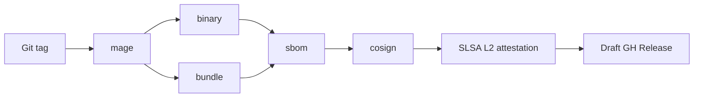

# SREDIAG — Security & Compliance Architecture

## 0 · Defence-in-Depth Stack

| Layer | Primary Controls | Code / Location |
| :---- | :--------------- | :-------------- |
| **Supply-Chain** | cosign sig + SHA-256 allow-list · SBOM · SLSA L2 | **CI pipeline**  |
| `magefiles/`, `.github/workflows` |  |  |
| **Binary Integrity** | PIE build · `plugin.Manager.Verify()` | `internal/plugin/verify.go` |
| **Identity & Transport** | SPIFFE-mTLS 1.3 · cert rotation · least-priv gRPC creds | `internal/core/tls.go` |
| **Runtime Sandboxing** | seccomp `runtime/default` · RO rootfs · non-root UID 65534 | `internal/plugin/sandbox.go` |
| **Resource Guard** | mem / CPU / disk circuit-breakers | `internal/core/mem_guard.go` |
| **RBAC & AuthN/Z** | JWT / OAuth2 · verb ↔ capability map | `internal/core/rbac.go` |
| **Observability & Audit** | OTLP logs for every auth & reload event | `internal/core/audit.go` |

Each layer fails **closed** upstream when a check trips.

---

## 1 · Threat Assumptions

| ID | Assumption | Rationale |
| :-- | :--------- | :-------- |
| **A-1** | Adversary can read any in-transit packet | Edge → CP crosses WAN |
| **A-2** | Adversary can plant a malicious plugin bundle | MSP fleet with mixed trust |
| **A-3** | Local user *may* gain shell inside the node | shared Kubernetes worker |
| **A-4** | Crash loops must never drop telemetry silently | SRE observability requirement |

Controls below map directly to these assumptions.

---

## 2 · Supply-Chain Pipeline (build ➜ release)

* **cosign** keyless, fulcio-rooted (re-check at install).
* **Syft** SBOM published with image digest; referenced in OCI labels.
* In-toto envelope records Go compiler hash and otelcol commit ID.

---

## 3 · Plugin Trust Chain

| Step | Check | On Failure |
| :--- | :---- | :--------- |
| **1 Discover** | `*.tar.gz` → manifest present | mark *invalid* |
| **2 Digest** | SHA-256(body) == `manifest.sha256` | refuse load |
| **3 Signature** | cosign verify (system scope) | refuse load |
| **4 ABI** | Go 1.24, OTel API v1.30.0 | log & refuse |
| **5 Capabilities** | listed verbs allowed by RBAC | refuse unless caller role ≥ required |

Result states: *active* · *disabled* · *invalid*.

---

## 4 · Runtime Sandboxing

| Profile | System scope | User scope |
| :------ | :----------- | :--------- |
| **seccomp** | `runtime/default` + `perf_event_open` (opt-in) | same |
| **apparmor** | `strict` (RO `/proc`, no ptrace) | `complain` |
| **cgroup (cpu.weight)** | 100 → dynamic | 50 |
| **memlock** | 16 MiB | 16 MiB |
| **netcls** | only `lo` allowed | only `lo` |

Sandbox policy YAML lives in `internal/plugin/sandbox/policy.go` and is
subject to weekly OPA tests.

---

## 5 · Cryptographic Defaults

| Purpose | Algorithm | Min size | Rotation |
| :------ | :-------- | :------- | :------- |
| TLS data-plane | TLS 1.3 / AES-256-GCM-SHA384 | 2048-bit RSA or P-256 | 90 days |
| RocksDB at rest | AES-256-GCM (optional) | — | user-defined |
| JWT HS / RS | HS256 / RS256 | 32 B secret / 2048 bit key | 24 h |
| SBOM hash | SHA-256 | — | — |

All tls.* keys must reside on tmpfs or injected via KMS.

---

## 6 · RBAC & Capabilities Map

| Capability | RBAC Verb | Role(s) in default policy |
| :--------- | :-------- | :------------------------ |
| `diag/system` | `read:diag` | operator, admin |
| `diag/perf/*` | `write:diag` | operator, admin |
| `processor/vectorhash` | `write:telemetry` | operator, admin |
| `extension/zpages` | `read:debug` | viewer, operator, admin |

Policy authoring belongs in `configuration/security.md`; architecture
only defines the mapping principle.

---

## 7 · Audit & Telemetry

* **OTLP Logs** – every **authN** failure, plugin state change, sandbox
  violation.
* **Metrics** –
  `srediag_auth_failures_total`,
  `srediag_plugin_verification_failures_total`,
  `srediag_sandbox_violations_total`.
* **Sampling** – audit logs *never* sampled; other logs follow pipeline
  rules.

---

## 8 · Compliance Hooks

| Standard | Evidence Path |
| :------- | :------------ |
| ISO 27001 A.12.4 Logging | OTLP audit stream |
| SOC 2 CC1.4 Change Mgmt | plugin hot-swap attestation |
| PCI-DSS 4.1 Encryption | TLS 1.3 everywhere |
| LGPD Art. 46 Security | RocksDB AES-GCM (optional) |

---

## 9 · Cross-Document Index

| Topic | Reference |
| :---- | :-------- |
| Runtime knobs & YAML | `configuration/security.md` |
| Collector & plugin layers | `architecture/service-collector.md` |
| Supply-chain detail | `security/supply-chain.md` |
| Plugin manifest rules | `configuration/plugins.md` |
| Build-release pipeline | `build/architecture.md` |
